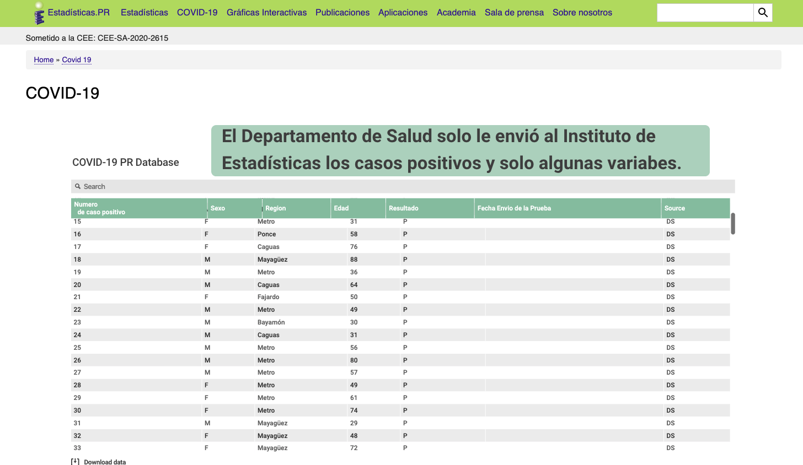

# (Work-in-progress) COVID-19 Open API for data in Puerto Rico

[The Institute of Statistics of Puerto Rico](https://estadisticas.pr/en) has prepared an open database for COVID-19 cases in Puerto Rico, sourced by the Department of Health. The goal of this project is to offer developers an easy way to access COVID-19 datasets from Puerto Rico. Currently the open database only includes cases from the Department of Health, but please submit an isssue if you have ideas for more. 



*Data will be uploaded daily from their [website](https://estadisticas.pr/en/covid-19). (Last Updated 4/2/20 7:00 AM).*

## **Disclaimer:** 

The data in this API was sourced from [The Department of Health of Puerto Rico](http://salud.gov.pr/). Data may have errors and/or omissions. 

## Data Sources

1. Official daily report from the [Puerto Rico Medical Task Force COVID-19](data/README.md)

## Installation

```Coming Soon```

### GET /cases

Get all current published data about COVID-19 cases in Puerto Rico. 

**Sample Response**

```
[
   {
      "id":1,
      "edad":68,
      "numero_de_caso_positivo":1,
      "sexo":"F",
      "region":"Metro",
      "resultado":true,
      "fecha_de_envio_de_prueba":null,
      "source":"DS",
      "created_at":"2020-04-01T14:23:28.817Z",
      "updated_at":"2020-04-01T14:23:28.817Z"
   },
   {
      "id":2,
      "edad":70,
      "numero_de_caso_positivo":2,
      "sexo":"M",
      "region":"Metro",
      "resultado":true,
      "fecha_de_envio_de_prueba":null,
      "source":"DS",
      "created_at":"2020-04-01T14:47:19.603Z",
      "updated_at":"2020-04-01T14:47:19.603Z"
   },
   {
      "id":3,
      "edad":72,
      "numero_de_caso_positivo":3,
      "sexo":"M",
      "region":"Metro",
      "resultado":true,
      "fecha_de_envio_de_prueba":null,
      "source":"DS",
      "created_at":"2020-04-01T15:06:03.126Z",
      "updated_at":"2020-04-01T15:06:03.126Z"
   }
]
```

### GET /cases/:id

Find data about an individual case by number. 

**Sample Response**

```
{
   "id":1,
   "edad":68,
   "numero_de_caso_positivo":1,
   "sexo":"F",
   "region":"Metro",
   "resultado":true,
   "fecha_de_envio_de_prueba":null,
   "source":"DS",
   "created_at":"2020-04-01T14:23:28.817Z",
   "updated_at":"2020-04-01T14:23:28.817Z"
}
```

### GET /cases/count

Get total number of **positive** cases.

**Sample Response**

```
239
```
