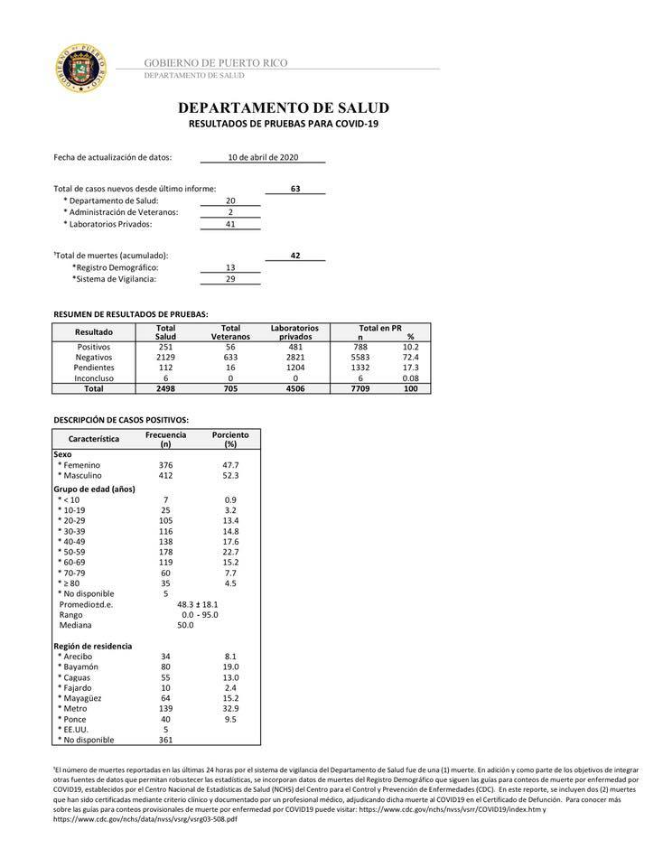
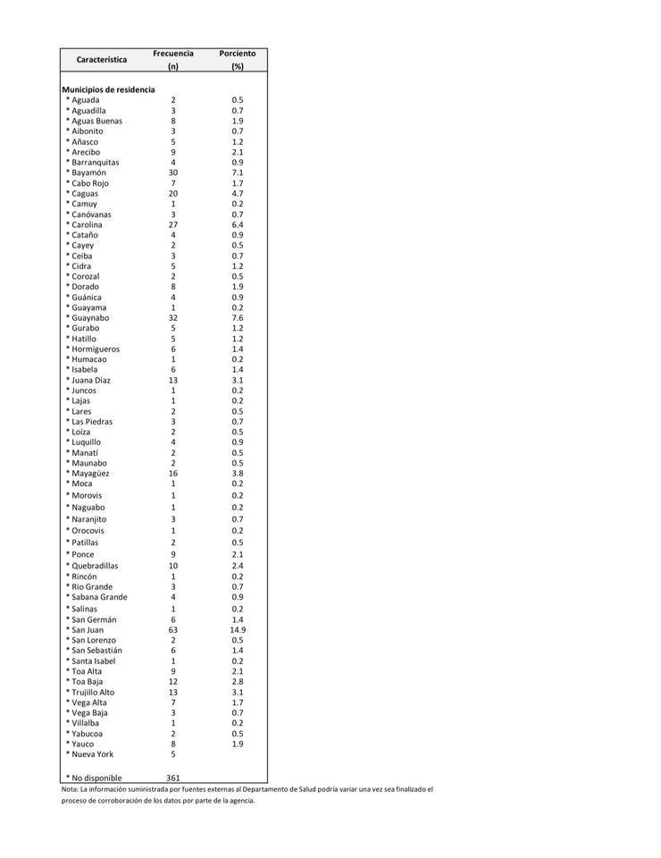
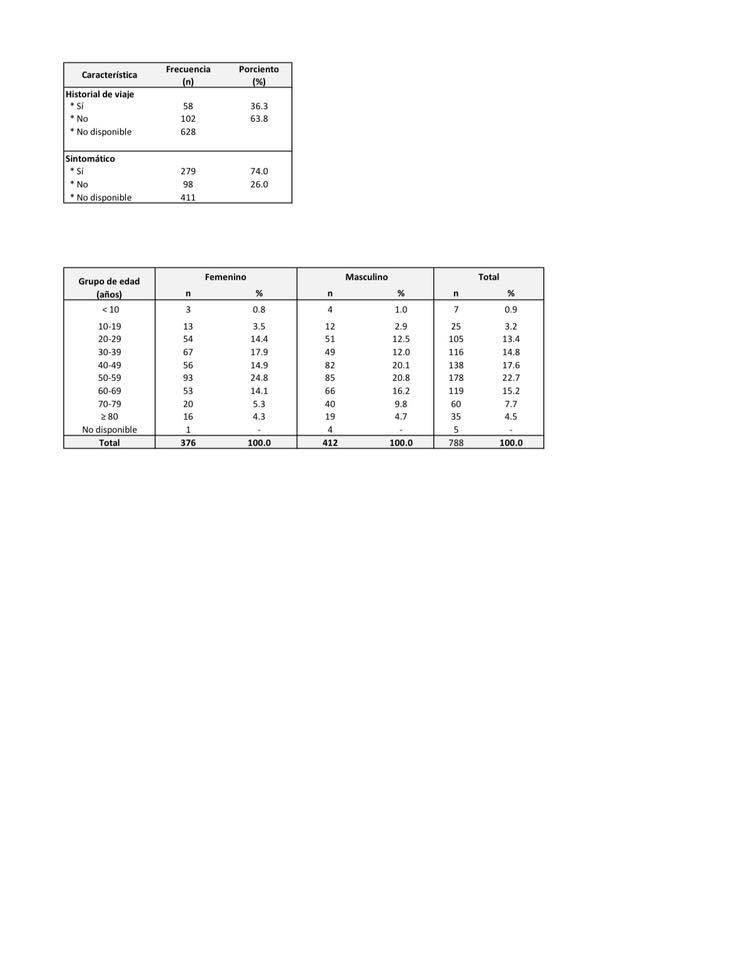
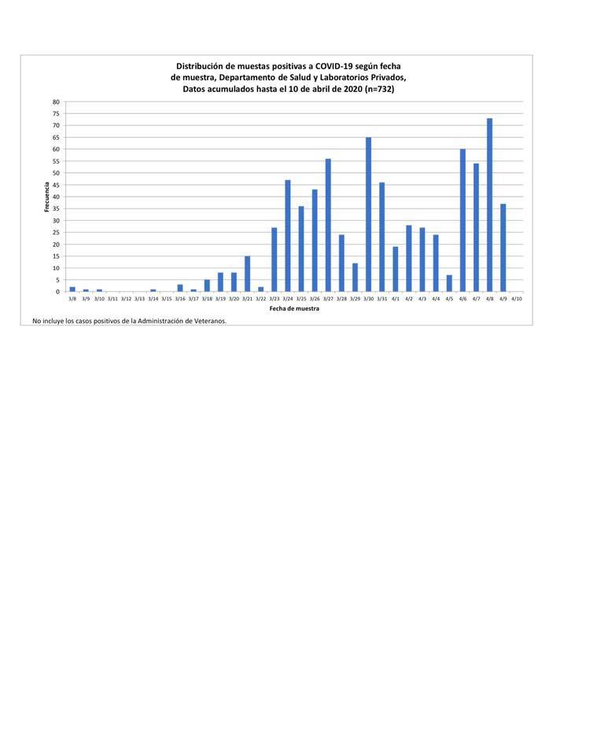

# April 11, 2020

## CSV

1. [Resumen de Resultados de Pruebas](CSV/resumen.csv)
1. [Descripción de Casos Positivos](CSV/descripcion_casos_positivos.csv)
1. [Municipios](CSV/municipios.csv)
1. [Edades](CSV/edades.csv)
1. [Historial de Viaje](CSV/historial_de_viaje.csv)

## JPG (Original)

